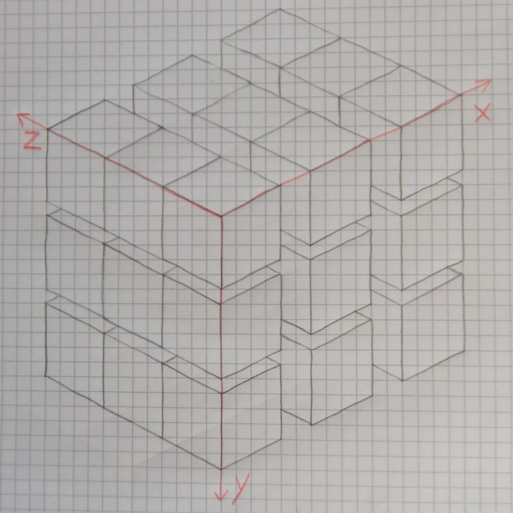

# Can Proptest solve a Rubik's Cube?

Let me preface this by saying that I don't know how to solve a Rubik's Cube, but I'm trying to
figure it out without looking it up (so far I've only figured out the 2×2×2 one). So I don't even
know how many states there are that can be reached without disassembling and reassembling the cube.

I wanted to see if I can solve a Rubik's Cube by abusing property based tests. Basically the idea is
write a test that asserts that for any list of moves the cube is unsolvable or will not lead to a
solved state in the cube. If the configuration is indeed solvable, proptest will reduce the moves
required and print the solution.

The first implementation was very naive. So for example we'd happily try the same move more than
three times in a row. Also, I think there's probably a bias for rotation direction, because we don't
encode direction in the moves. This is because we can encode a counterclockwise move as the same
clockwise move three times in a row.

Later I implemented a strategy that generates the same move up to three times in a row, but no more.
This seems to make it somewhat more effective at solving the 2×2×2 cube.

But with both implementations I was unable to solve a 3×3×3 cube unless it was only a few moves away
from being solved.

The representation of the cube is also not the most efficient. There's a `Color` enum that encodes
the six colors plus an `Inside` variant. The cube is just a multidimensional array of pieces, each
of which has six sides with colors. So we even encode the center piece that has the `Inside` color
on each side. All this is simply because it makes it easier to reason about (for me, at least). Of
course this also means that we can encode tons of invalid and nonsensical states.



This shows both the coordinates and the nesting of the arrays. The x axis is the outermost array and
the z one the innermost.

## Got an unsolved cube?

It better be a 2×2×2 cube. 3×3×3 ones don't seem solvable by this in a reasonable time, unless
they're only a few moves away from a solved state.

Enter the colors on your cube into the `cube!` macro invocation in `tests/proptest_unsolvable.rs`.

The orientation of the faces in the `cube` macro is a bit strange. For the `top` face, take the z
axis as the x axis and x as y, for the left one it's y as x and z as y. Then the bottom and right
ones are that, but flipped. This preserves the origin and keeps the axes poining to the left and
down. I didn't spend a whole lot of time thinking about the alternatives, so perhaps there is an
option that both a simpler implementation and a clearer notation.

Then run:

```sh
cargo test --release
```

Without `--release` also works, but is much slower. On my machine it was about 20x slower.

The output might look something like this:

```
thread 'unsolvable' panicked at tests/proptest_unsolvable.rs:4:1:
Test failed: assertion failed: !cube.solved() at tests/proptest_unsolvable.rs:42.
minimal failing input: ref vec = [
    X(
        1,
    ),
    Z(
        1,
    ),
    Y(
        1,
    ),
    Y(
        1,
    ),
    Z(
        0,
    ),
    Z(
        1,
    ),
    X(
        1,
    ),
    Y(
        1,
    ),
    Y(
        0,
    ),
]
        successes: 121205
        local rejects: 0
        global rejects: 0
```

In this case (a 2×2×2 cube) the cube was solved in the middle of these instuctions and then actually
unsolved and re-solved.

## What about a fuzzer?

I also tried it with cargo-fuzz and libFuzzer. I also couldn't get it to solve the 3×3×3 one, but
with the 2×2×2 one it actually seemed somewhat slower than proptest in release mode. This is likely
because of all the instrumentation that llvm adds to the binary. I'm also guessing that tracking the
branches the code makes is just not that effective for a Rubik's Cube.

This comparison was with both of them just chaining moves together. So before I implemented the
slighly better strategy for proptest. I haven't bothered to implement that one for the fuzzer. Also
I'm not quite sure how long the arbitrary crate makes vecs by default.
